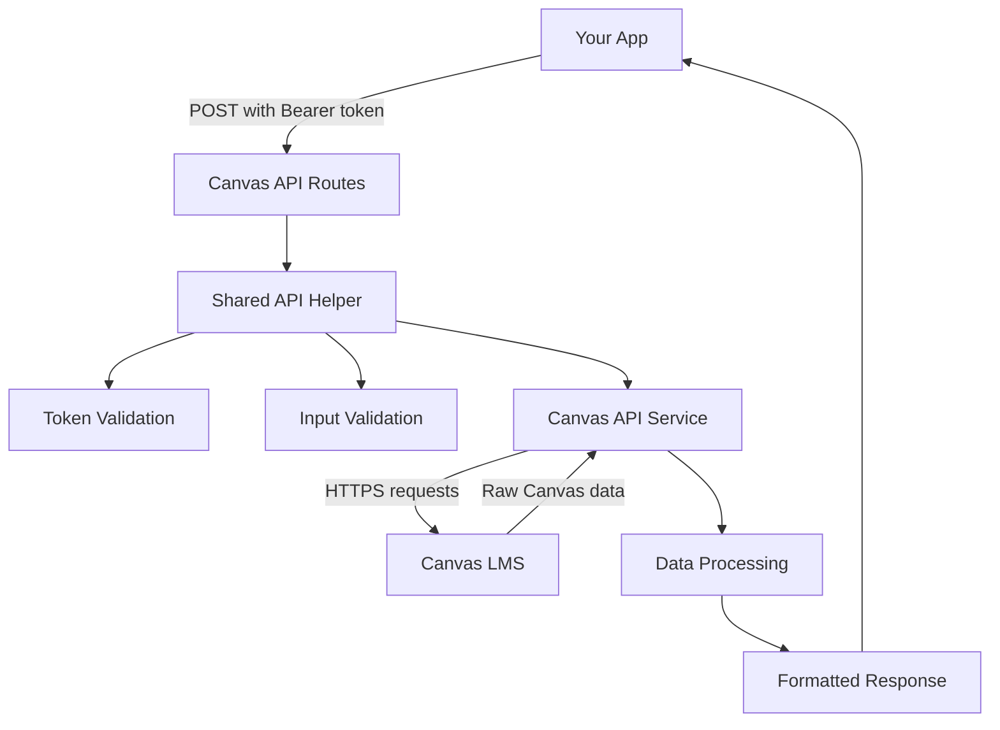

# How to Use the Canvas API - Complete Guide

## 🚀 **Quick Start**

The API is now **POST-only with Bearer token authentication** for security:

```javascript
// ✅ NEW (Secure) - Use this approach
const response = await fetch('/api/canvas/courses', {
  method: 'POST',
  headers: {
    'Content-Type': 'application/json',
    'Authorization': `Bearer ${canvasToken}`
  },
  body: JSON.stringify({
    canvasUrl: 'https://canvas.instructure.com'
  })
});

// ❌ OLD (Insecure) - Don't use anymore  
// GET /api/canvas/courses?accessToken=secret_token&canvasUrl=...
```

## 🔄 **How the Data Flow Works**

Here's how your Canvas data flows through the system:



### **Step-by-Step Flow:**

1. **Your App** sends POST request with Bearer token
2. **API Helper** validates token format and input 
3. **Canvas Service** makes authenticated requests to Canvas LMS
4. **Data Processing** transforms raw Canvas data into consistent format
5. **Response** returns clean, typed data to your app

## 📊 **Complete Usage Examples**

### **1. Get Your Courses**

```javascript
async function getCourses(canvasToken, canvasUrl) {
  try {
    const response = await fetch('/api/canvas/courses', {
      method: 'POST',
      headers: {
        'Content-Type': 'application/json',
        'Authorization': `Bearer ${canvasToken}`
      },
      body: JSON.stringify({ canvasUrl })
    });

    const result = await response.json();
    
    if (result.success) {
      console.log('Your courses:', result.data);
      return result.data; // Array of course objects
    } else {
      console.error('Error:', result.error);
      return null;
    }
  } catch (error) {
    console.error('Network error:', error);
    return null;
  }
}

// Usage
const courses = await getCourses(
  'your_canvas_token_here',
  'https://canvas.instructure.com'
);
```

**Response Format:**
```json
{
  "data": [
    {
      "id": 12345,
      "name": "Introduction to Computer Science",
      "course_code": "CS101"
    }
  ],
  "success": true
}
```

### **2. Get Assignments for a Course**

```javascript
async function getAssignments(canvasToken, canvasUrl, courseId) {
  const response = await fetch('/api/canvas/assignments', {
    method: 'POST',
    headers: {
      'Content-Type': 'application/json',
      'Authorization': `Bearer ${canvasToken}`
    },
    body: JSON.stringify({ 
      canvasUrl, 
      courseId 
    })
  });

  const result = await response.json();
  return result.success ? result.data : [];
}

// Usage
const assignments = await getAssignments(
  'your_canvas_token_here',
  'https://canvas.instructure.com',
  12345
);
```

**Response Format:**
```json
{
  "data": [
    {
      "id": 67890,
      "name": "Homework Assignment 1",
      "course_id": 12345,
      "due_at": "2024-01-15T23:59:00Z",
      "submission_status": "Not Submitted",
      "points_possible": 100,
      "html_url": "https://canvas.instructure.com/courses/12345/assignments/67890"
    }
  ],
  "success": true
}
```

### **3. Get Announcements for Multiple Courses**

```javascript
async function getAnnouncements(canvasToken, canvasUrl, courseIds) {
  const response = await fetch('/api/canvas/announcements', {
    method: 'POST',
    headers: {
      'Content-Type': 'application/json',
      'Authorization': `Bearer ${canvasToken}`
    },
    body: JSON.stringify({ 
      canvasUrl, 
      courseIds // Array of course IDs
    })
  });

  const result = await response.json();
  return result.success ? result.data : [];
}

// Usage
const announcements = await getAnnouncements(
  'your_canvas_token_here',
  'https://canvas.instructure.com',
  [12345, 67890, 54321] // Multiple course IDs
);
```

### **4. Get Complete Dashboard (Recommended)**

This is the **main endpoint** that gets everything at once:

```javascript
async function getDashboard(canvasToken, canvasUrl) {
  const response = await fetch('/api/canvas/dashboard', {
    method: 'POST',
    headers: {
      'Content-Type': 'application/json',
      'Authorization': `Bearer ${canvasToken}`
    },
    body: JSON.stringify({ canvasUrl })
  });

  const result = await response.json();
  
  if (result.success) {
    const { entities, views } = result.data;
    
    // Access your data using the organized structure
    console.log('Your courses:', Object.values(entities.courses));
    console.log('Upcoming assignments:', views.upcoming_assignments.map(id => entities.assignments[id]));
    console.log('Recent announcements:', Object.values(entities.announcements));
    
    return result.data;
  }
  
  return null;
}
```

**Dashboard Response Structure:**
```json
{
  "data": {
    "report_generated_on": "2024-01-01T12:00:00Z",
    "entities": {
      "courses": {
        "12345": { "id": 12345, "name": "CS101" }
      },
      "assignments": {
        "67890": { "id": 67890, "name": "Homework 1", "due_at": "...", "submission_status": "Not Submitted" }
      },
      "announcements": {
        "11111": { "id": 11111, "title": "Welcome!", "course_id": 12345 }
      }
    },
    "views": {
      "upcoming_assignments": [67890],
      "unsubmitted_assignments": [],
      "assignments_by_course": { "12345": [67890] },
      "announcements_by_course": { "12345": [11111] }
    }
  },
  "success": true
}
```

## 🔧 **Real-World React Integration**

### **Custom Hook for Canvas Data:**

```jsx
// hooks/useCanvasData.js
import { useState, useEffect } from 'react';

export function useCanvasData(canvasToken, canvasUrl) {
  const [data, setData] = useState(null);
  const [loading, setLoading] = useState(false);
  const [error, setError] = useState(null);

  useEffect(() => {
    if (!canvasToken || !canvasUrl) return;

    async function fetchDashboard() {
      setLoading(true);
      setError(null);

      try {
        const response = await fetch('/api/canvas/dashboard', {
          method: 'POST',
          headers: {
            'Content-Type': 'application/json',
            'Authorization': `Bearer ${canvasToken}`
          },
          body: JSON.stringify({ canvasUrl })
        });

        const result = await response.json();

        if (result.success) {
          setData(result.data);
        } else {
          setError(result.error);
        }
      } catch (err) {
        setError('Failed to fetch Canvas data');
      } finally {
        setLoading(false);
      }
    }

    fetchDashboard();
  }, [canvasToken, canvasUrl]);

  return { data, loading, error };
}
```

### **Dashboard Component:**

```jsx
// components/CanvasDashboard.jsx
import { useCanvasData } from '../hooks/useCanvasData';

export function CanvasDashboard({ canvasToken, canvasUrl }) {
  const { data, loading, error } = useCanvasData(canvasToken, canvasUrl);

  if (loading) return <div>Loading Canvas data...</div>;
  if (error) return <div>Error: {error}</div>;
  if (!data) return <div>No data available</div>;

  const { entities, views } = data;

  return (
    <div className="canvas-dashboard">
      <h2>Your Canvas Dashboard</h2>
      
      {/* Upcoming Assignments */}
      <section>
        <h3>Upcoming Assignments ({views.upcoming_assignments.length})</h3>
        {views.upcoming_assignments.map(assignmentId => {
          const assignment = entities.assignments[assignmentId];
          const course = entities.courses[assignment.course_id];
          
          return (
            <div key={assignmentId} className="assignment-card">
              <h4>{assignment.name}</h4>
              <p>Course: {course?.name}</p>
              <p>Due: {new Date(assignment.due_at).toLocaleDateString()}</p>
              <p>Status: {assignment.submission_status}</p>
              <a href={assignment.html_url} target="_blank" rel="noopener noreferrer">
                View in Canvas →
              </a>
            </div>
          );
        })}
      </section>

      {/* Recent Announcements */}
      <section>
        <h3>Recent Announcements</h3>
        {Object.values(entities.announcements)
          .sort((a, b) => new Date(b.posted_at) - new Date(a.posted_at))
          .slice(0, 5)
          .map(announcement => {
            const course = entities.courses[announcement.course_id];
            
            return (
              <div key={announcement.id} className="announcement-card">
                <h4>{announcement.title}</h4>
                <p>From: {course?.name}</p>
                <p>Posted: {new Date(announcement.posted_at).toLocaleDateString()}</p>
              </div>
            );
          })}
      </section>
    </div>
  );
}
```

## 🚫 **Error Handling**

The API returns structured errors. Here's how to handle them:

```javascript
async function handleCanvasRequest(endpoint, data) {
  try {
    const response = await fetch(`/api/canvas/${endpoint}`, {
      method: 'POST',
      headers: {
        'Content-Type': 'application/json',
        'Authorization': `Bearer ${canvasToken}`
      },
      body: JSON.stringify(data)
    });

    const result = await response.json();

    if (!result.success) {
      // Handle different types of errors
      switch (response.status) {
        case 401:
          console.error('Invalid or expired Canvas token');
          // Redirect to login or refresh token
          break;
        case 400:
          console.error('Bad request:', result.error);
          // Show validation error to user
          break;
        case 500:
          console.error('Server error:', result.error);
          // Show generic error message
          break;
        default:
          console.error('Unexpected error:', result.error);
      }
      
      return null;
    }

    return result.data;
  } catch (error) {
    console.error('Network error:', error);
    return null;
  }
}
```

## 🔒 **Security Best Practices**

### **1. Never expose tokens in client-side code:**
```javascript
// ❌ DON'T DO THIS - Token exposed in frontend
const CANVAS_TOKEN = 'canvas_token_12345';

// ✅ DO THIS - Store in secure environment variables
const canvasToken = process.env.CANVAS_ACCESS_TOKEN; // Server-side only
```

### **2. Use environment variables:**
```javascript
// .env.local
CANVAS_ACCESS_TOKEN=your_token_here
CANVAS_URL=https://your-school.instructure.com
```

### **3. Validate URLs:**
```javascript
function isValidCanvasUrl(url) {
  try {
    const parsedUrl = new URL(url);
    return parsedUrl.protocol === 'https:' && 
           parsedUrl.hostname.includes('instructure.com');
  } catch {
    return false;
  }
}
```

## 🎯 **Why This Design is Better**

### **Before (Problems):**
- 🚨 Tokens in URLs (security risk)
- 📋 Duplicate code everywhere
- 🤷 Unclear which method to use
- 🐛 Inconsistent error handling

### **After (Solutions):**
- 🔒 **Secure**: Bearer tokens in headers
- 🎯 **Clean**: Single shared handler logic
- 📖 **Clear**: POST-only, well-documented
- 🛡️ **Robust**: Consistent error handling

## 📝 **Summary**

**Use the dashboard endpoint** for most cases:
```javascript
// This gets everything you need in one call
const dashboardData = await fetch('/api/canvas/dashboard', {
  method: 'POST',
  headers: {
    'Authorization': `Bearer ${canvasToken}`,
    'Content-Type': 'application/json'
  },
  body: JSON.stringify({ canvasUrl })
}).then(r => r.json());
```

**Use individual endpoints** when you need specific data:
- `/api/canvas/courses` - Just your course list
- `/api/canvas/assignments` - Assignments for one course  
- `/api/canvas/announcements` - Announcements for specific courses

The **dashboard endpoint is usually your best choice** because it gets all your Canvas data efficiently in a single request! 